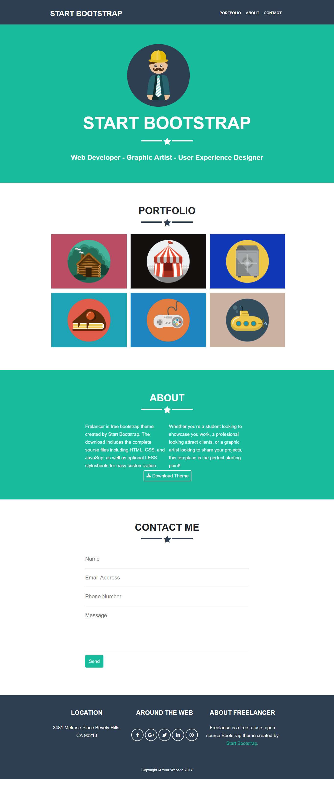

# Reto Freelancer

Se ha creado un repositorio boilerplate (plantilla
inicial) con todos los recursos necesarios. Esto incluye imágenes y
estructura de carpetas y archivos donde se colocará mi código.

## Objetivo

El reto consiste en replicar el sitio de **Freelancer**, este será el resultado
a lograr:

[sitio original](https://blackrockdigital.github.io/startbootstrap-freelancer/)
<--- clic

## Resultado:

 En el siguiente .gif se visualiza el resultado final de mi maquetado:
 

 

 Además lo podrás encontrar [aqui](https://jessica2011.github.io/freelancer/)

 Gracias
